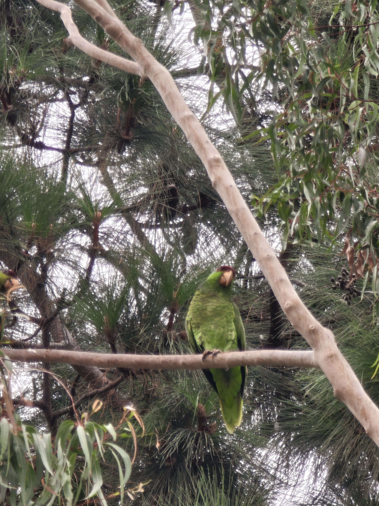

[General](#who-am-i)

[Me academically](#what-classes-am-i-taking-this-quarter)

[My Hobbies](#what-do-i-like-to-do-outside-of-class)

# Who am I?

My name is **Jialin Wang**, and I also go by **Julian**. I am a second year computer science major.

[My favorite programming language](./README.md)

# What classes am I taking this quarter?

- CSE 110
- CSE 120
- CSE 95
- HUM 5

# What do I plan to learn in CSE 110?

- [ ] Prepare for industry
- [ ] Learn more technical skills
- [X] Survive

# What do I like to do outside of class?

In my spare time I like to go birdwatching and play video games. 

Latest lifer: Lilac-Crowned Amazon (spotted at Tustin)


My top-3 most played Steam games:

1. Street Fighter 6 ~~Please don't flame me for maining JP lmao~~
2. Baldur's Gate 3
3. Slay the Spire

I'm also trying out [Balatro](https://store.steampowered.com/app/2379780/Balatro/) recently

# What is my personal motto?

> The only way out is through.

# Here's a random binary search code segment in python because I am required to include it in this assignment lol
```
def binary_search(arr, target):
    low = 0
    high = len(arr) - 1

    while low <= high:
        mid = (low + high) // 2
        if arr[mid] == target:
            return mid
        elif arr[mid] < target:
            low = mid + 1
        else:
            high = mid - 1
    return -1
```